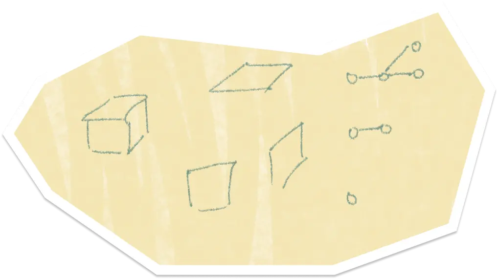
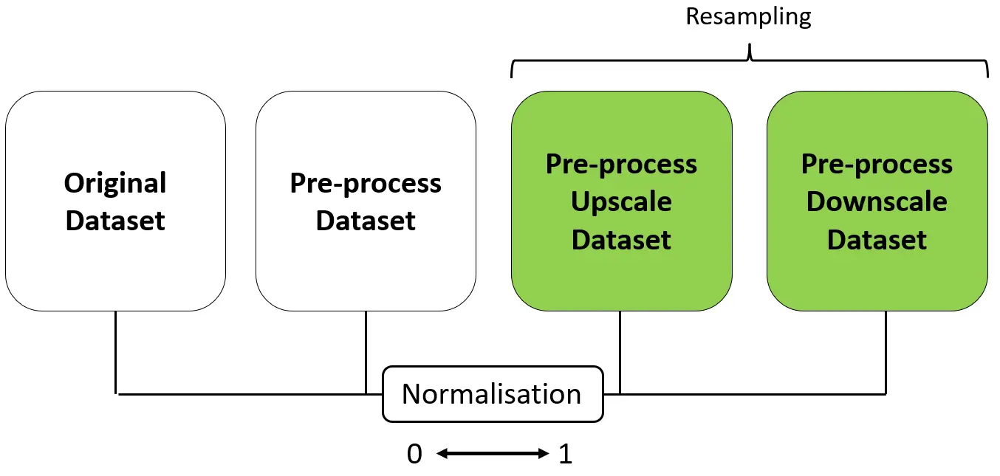
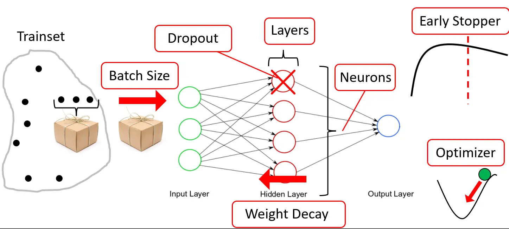
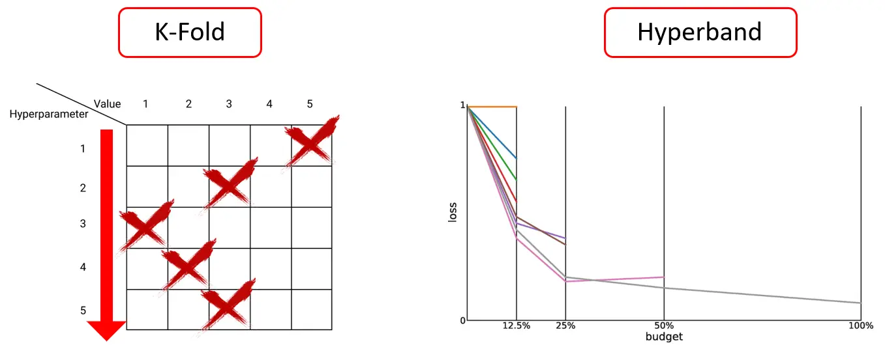
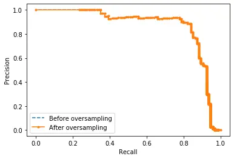
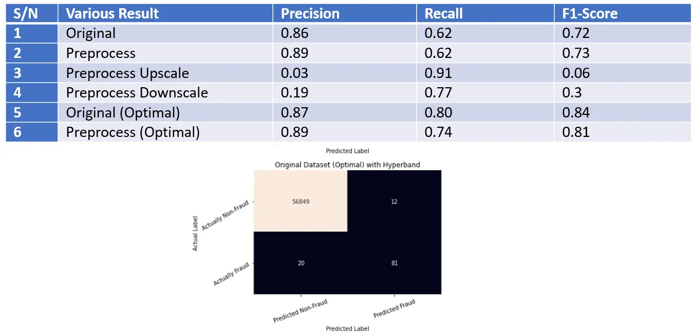

# Credector

It is one of the [NTU](https://www.ntu.edu.sg/)'s CZ4032 Data Analytics and Mining Module Project

## What?

We are tasks to source for a public datasets complex enough to apply data mining techniques and return a meaningful or relevant information.

## Why?

To apply data mining techniques base on what we have learnt from this module.

## How?

1. Analysis datasets structure and complexity
2. Preprocess and normalised datasets
3. Optimisation techniques for the given dataset if necessary
4. Compare results and provide necessary remarks
5. Conclusion of the results
6. Automatised it if need to

## Highlights

Neural Network Approach

## Disclaimer

All external data and assets in this project used is intended for educational purpose only.

## Contributor

Credector Team
